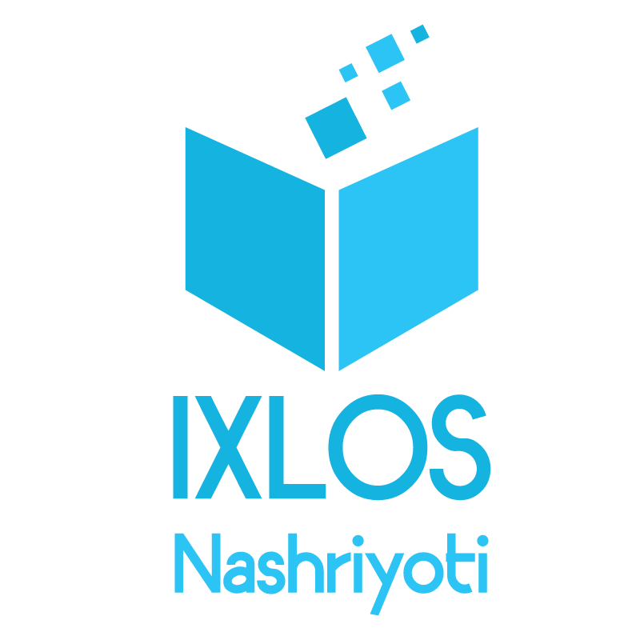
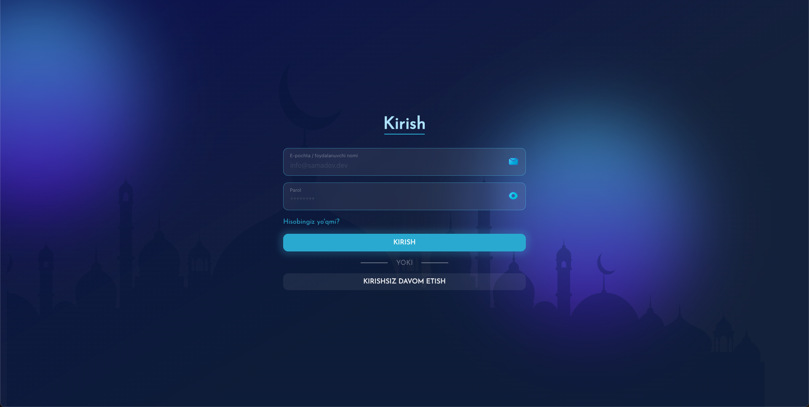
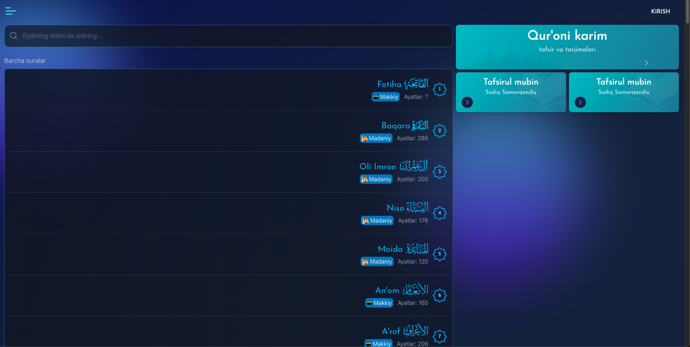
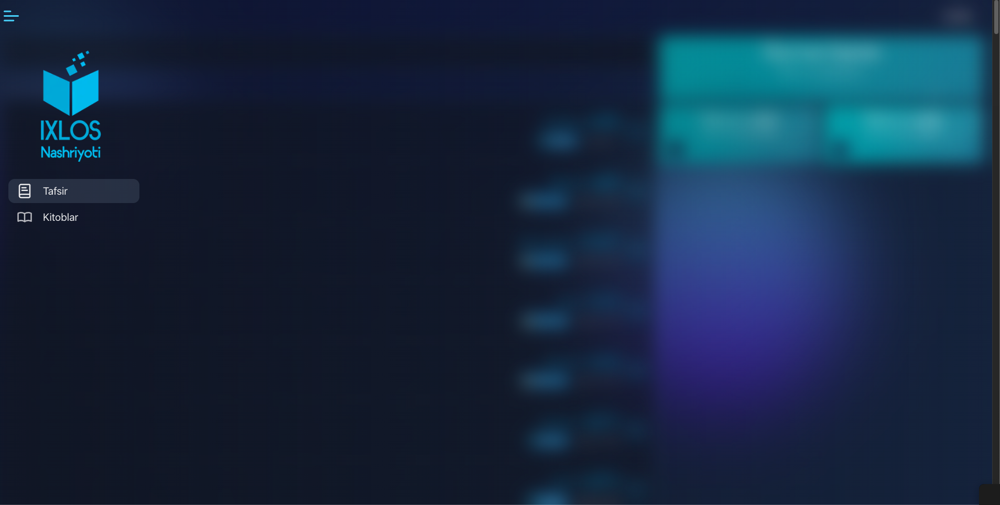

<p align="center">
  
</p>

# Ixlos Web App 🚀

**Discover. Learn. Elevate.** Ixlos is a modern, lightning-fast web application delivering a vast library of Islamic educational e-books and comprehensive Holy Quran interpretations.

[](https://github.com/gamalsamadov/ixlos-client/stargazers) [](https://github.com/gamalsamadov/ixlos-client/blob/main/LICENSE)

---

## 🔥 Why Ixlos?

- **Comprehensive Knowledge**: Access a curated collection of classical and contemporary Islamic texts.
- **In-depth Tafsir**: Explore verse-by-verse interpretations from renowned scholars.
- **Offline e-Books**: Download and read anywhere, anytime with built-in offline support.
- **Interactive Learning**: Engage with smooth animations and intuitive UI for an immersive experience.

---

## ✨ Key Features

| Feature                         | Description                                                                                       |
|---------------------------------|---------------------------------------------------------------------------------------------------|
| 🚀 GraphQL-Powered Data         | Client-side data fetching with **@apollo/client** and auto-generated hooks via GraphQL Codegen    |
| ✍️ Rich Text Editing            | Built-in editor using **@tiptap/react** (starter-kit + heading, highlight, text-align extensions)|
| 🛡️ Type Safety                  | Entire codebase in **TypeScript** with generated types from `@graphql-codegen/typescript`         |
| 🌐 Internationalization         | Locale-aware content and routing powered by **next-intl**                                         |
| 🎨 Utility-First Styling        | Styled with **Tailwind CSS** (incl. typography + animate plugins) and **SASS** for custom tweaks  |
| 🌓 Dark/Light Themes            | Automatic theme switching with **next-themes**                                                    |
| ⚡ Top-Loading Progress         | Slim progress bar on route changes via **nextjs-toploader**                                       |
| 🧠 State Management             | Atomic state with **jotai** for predictable, minimal re-renders                                   |
| 🔔 Toast Notifications          | Delightful user feedback using **sonner**                                                          |
| 🛠️ Forms & Validation           | Flexible forms powered by **react-hook-form**                                                     |
| 🖋️ Iconography                  | Crisp, customizable icons from **lucide-react**                                                   |
| 🔍 Code Quality                  | Enforced with **ESLint** (standard, import, Prettier, TailwindCSS plugins)                        |

---

## 🎨 Screenshots

<p align="center">
  
  
  
</p>

---

## 🛠️ Technologies Used

- **TypeScript**
- **Next.js 15**
- **React 19**
- **Tailwind CSS** (with typography & animate plugins)
- **SASS**
- **Framer Motion**
- **Apollo Client & GraphQL Codegen**
- **Tiptap**
- **Jotai**
- **Lucide React** (icons)
- **Sonner**
- **React Hook Form**
- **next-intl**
- **next-themes**
- **nextjs-toploader**

---

## 🚀 Getting Started

Lounch the server-side application and then follow these steps to run the project locally:

1. **Clone the repository**

   ```bash
   git clone https://github.com/gamalsamadov/ixlos-client.git
   ```

2. **Install dependencies**

   ```bash
   cd ixlos-client
   npm install
   ```

3. **Create env file**
```
NEXT_PUBLIC_APP_URL='http://localhost:3000'
NEXT_PUBLIC_GRAPHQL_URL="http://localhost:4200/graphql"
NEXT_PUBLIC_MEDIA_URL="https://ixlos-nashriyoti.s3.eu-north-1.amazonaws.com"
```

4. **Run the development server**

   ```bash
   npm run dev
   ```

5. **Open your browser**

   Navigate to `http://localhost:3000` to view the project.

## 📫 Contact

Feel free to reach out to me if you have any questions or feedback!

- Email: info@samadov.dev
- Instagram: [@samadov.dev](https://www.instagram.com/janob.dev/)
- LinkedIn: [En. Samadov J.](https://linkedin.com/in/gamalsamadov)
